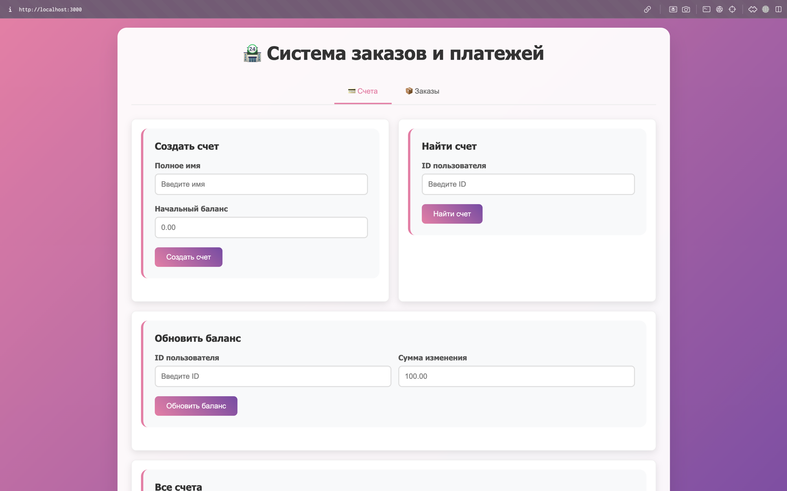

# Магазин
###### Мурашко Мария, БПИ 236

## Запуск

Запуск приложение происходит при помощи команды ```docker-compose up -d```

Это запустит все контейнеры в фоновом режиме.

После запуска будет доступна swagger документация:

http://localhost:8001/docs/ для сервиса заказов

http://localhost:8002/docs/ для сервиса оплат

А так же само приложение по ссылке

http://localhost:3000 

Примерно такую страничку можно увидеть перейдя по ссылке


## Решение

Всего есть два основных микросервиса (оплат и заказов). В них отдельно выделен слой инфраструктуры, модели, хэндлеры и сама бизнес-логика.
То есть все по лучшим советам прошлых заданий.

Помимо этого есть api-gateway запросы к которому делает фронтенд и сам фронтенд. После отправки запрос направляется в соответствующий микросервис.

Для общения между микросервисами используется Kafka. Для решения задачи нужно всего два топика. Слой общения с кафкой разделен интерфейсом брокера, благодаря чему кафку можно заменить на любой другой брокер сообщений.

Каждая часть системы обернута в отдельный Dockerfile.

В приложении реализованы все требуемые функции.

Пару слов сказать про сами заказы. При создании платежного генерируется его UUID. По нему уже можно создавать заказы. При создании заказа тому назначается статус ```CREATED```. Такой статус можно увидеть если посмотреть только что созданный заказ. Далее информация о нем передается в кафку и ждет обработки сервисом опаты. При возникновении ошибки, например при нехватке средств, деньги со счета не списываются. После обработки заказа изменяется его статус. При неудаче отобржается ```FAILED```.