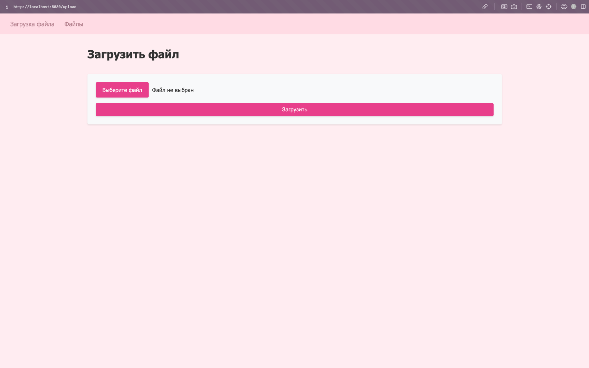
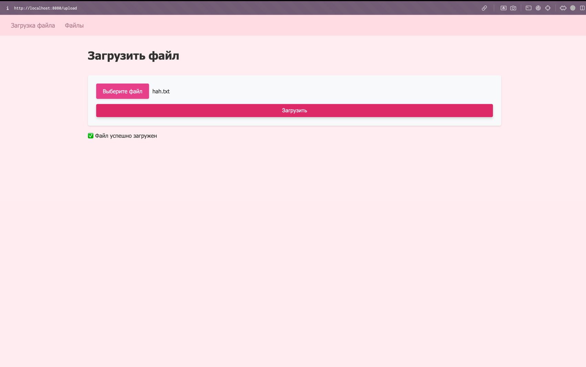
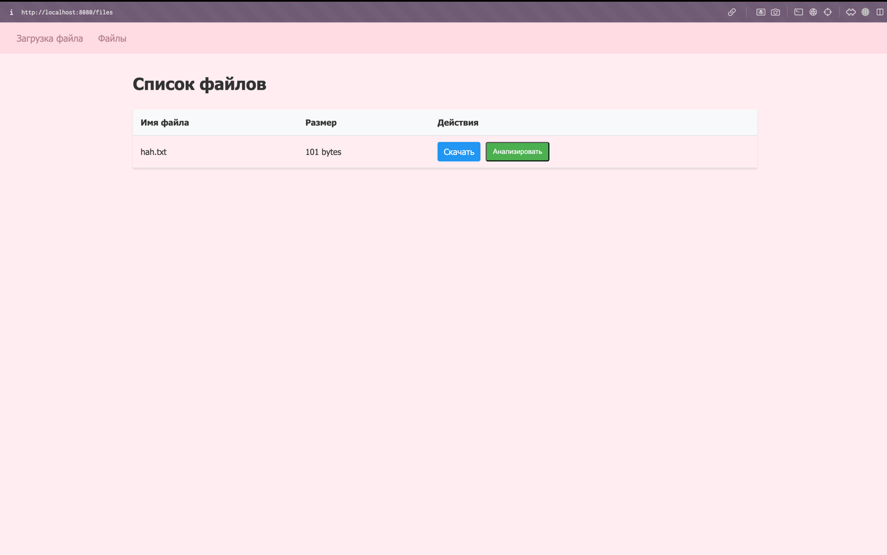
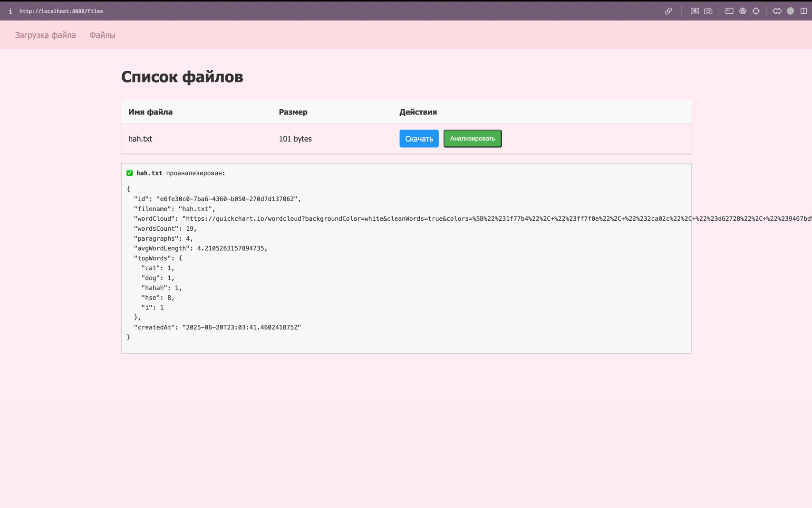
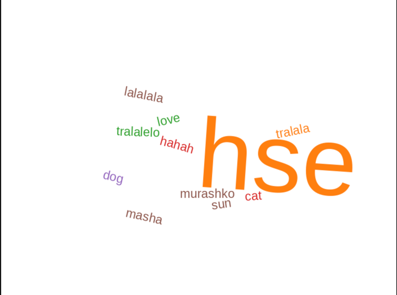

# ИДЗ-2 КПО
## Мурашко Мария

### Архитектура

Проект содержит несколько основных компонентов

- api-gateway 
- db - скрипты для инциализации базы данных
- file-analyzer - микросервис анализа файлов
- file-storage - микросервис хранения файлов

Основной сценарий использования. Пользователь загружает файл в систему -> далее пользователь прееходит к списку всех своих файлов. При желании доступна возможность скачивания файла. Далее пользователь запускает анализ файла

Если в базе данных с результатами анализа нет такого файла, то запускается анализ файла. Для этого идет запрос в сервис хранения файлов, который возвращает содержимое, после чего сервис анализа возвращается к свой работе и получает метрики по тексту, отправляет запрос для посторения облака слов

При анализе файла не учитываются так называемые стоп-слова. Так же есть возможность увидеть топ-10 слов (по умолчанию), но можно передать запрос вручную и меньшим/большим количеством.

Стоит уточнить, что на уровне базы данных не требуется, чтобы например имя файла было уникальным или содержимое, потому что при большомколичестве пользователь пересечения между именами файлов вполне возможны. Проверка на уникальность файла происходит уже в бизнес-логике приложения.

### Запуск
Микросервисы содержат докерфайлы, а запуск, сборка проекта, запуск базы данных производятся с помощью docker-cpmpose файла

### Работа приложения

В этом проекте, мне захотелось руками потестировать приложение. Поэтому вместо тестов и swagger был сделан небольшой фронтенд (по трудозатратам это оказалось гораздо сложнее и дольше, зато можно увидеть все глазами)

Давайте рассмотрим основной сценарий.

Пользователь запускает приложение и открывает сайт http://localhost:8080/upload

При нажатии на кнопку загрузки видим сообщение о том что все прошло успешно. Отлично!

Но, если попробовать загрузить тот же файл еще раз, видим сообщение об ошибке

Перейдем на страницу с файлами

Можно скачать файл, при нажатии на соответсвующую кнопку, но посмотрим на анализ

Перейдем по ссылке и посмотрим на облако слов. Конечно файл не очень большой так, что картинка не лучшая

