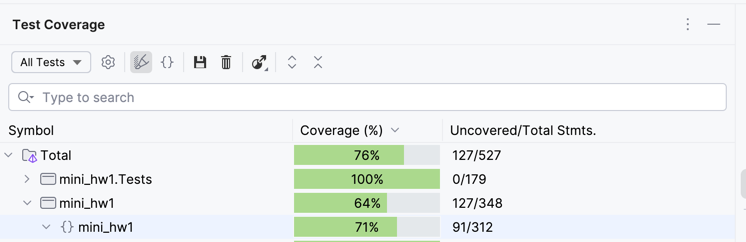

# КПО мини-дз 1
## Задание
Московский зоопарк обратился Высшую школу экономики с просьбой разработать ERP систему
предприятия, которая обеспечит автоматизацию, интеграцию и интеллектуальность, необходимые для
эффективного выполнения всех повседневных задач.
Со слов заказчика записано: «Мы хотим сделать наших животных чуть более счастливее! Счастливое
животное – в первую очередь сытое и здоровое животное! Нам важно, что бы они получали еду вовремя, а
также, согласно внутреннему регламенту, проходили медосмотр при приеме в наш зоопарк».
### Функциональные требования к приложению

1. Обеспечить возможность добавления новых животных в зоопарк.
2. Перед приемкой нового животного необходимо проверить его состояние здоровья (здоров /
   не здоров). Здоровье проверяет ветеринарная клиника, которая в ходе осмотра принимает
   одно из двух решений: принять животное в зоопарк или отказаться от данного животного.
3. Необходимо иметь возможность информировать о том какое количество килограмм еды
   нужно всем животным.
4. Необходимо иметь возможность предоставить информацию о тех животных, которые могут
   быть отправлены в контактный зоопарк.

### Структура проекта

## SOLID
Рассмотрим принципы ООП, примененные в проекте
### S - Single Responsibility
Разделяем ответственность классов. Зоопарк отвечает только за хранение и учет животных, ветеринанрная клиника только лечением и медецинским осмотром животных и тд.
### O - Open/Closed
Классы открыты для расшерения закрыты для изменений. При добавлении новых дивотных с особыми характеристиками можно использовать наследование, а не добавлять поля в существующие классы и интерфейсы.
### L - Liskov Substitution
Принцип подстановки Барбары Лисков говорит о том, что дочерние классы должны корректно заменять родительские, не нарушая логику программы. Он выполняется за счет того, что все сущности программы наследуются от интерфейсов, напрмер вместо IAnimal можно подставить любое животное, так как они должны реализовывать все методы родителя.
### I - Interface Segregation
Все классы и интерфейсы реализуют только необходимую логику и не более. Напрмер, все живые существа едят, поэтому в IAlive есть поле Food, но например проверка уровня доброты и опасности нужна только для животных, зоопарка. Таким образом если мы, напрмер, в систему учета зоопарка заходим добавить сотрудников и создаим класс человека, в нем не придется реализовывать ненужные методы.
### D - Dependency Inversion
Принцип инверсии зависимостей. Классы зависят не от конкретных реализаций, а от абстракций. Это делает код гибким и удобным для расширения.
Уходим от жестких связей при передачи зависимостей через конструктор, вместо инициализации через new
Испольщуем DI-контейнер. Он автоматически создает зависимости и контролирует их жизненный цикл. Таким образом мы точно уверены, что у нас только одна ветеринарная клиника и инвентарный менеджер, что не создаст проблем в коде и использования лишних ресурсов.

## Тесты
### Требование. Покрытие кода юнит тестами (не менее 60% покрытия)

