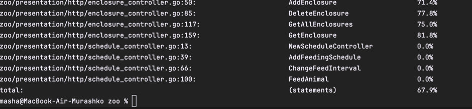

#Мини-дз 2

## DDD

### Сущности

Основные доменные объекты (`Animal`, `Enclosure`, `FeedingSchedule` находятся в папке `domain`. 

### Сервисы

Логика работы с животными и вольерами реализована в сервисе `AnimalService`, логика работы с расписанием кормления в `FeedingScheduleService`. 

### Репозитории

В качестве репозиториев в проекте используются InMemory репозитории, которые реализуют интерфейсы `AnimalRepository`, `EnclosureRepository` и `FeedingScheduleRepository`. Эти репозитории находятся в папке `infrastructure`.

### Доменные события
 Доменные события используются для фиксации изменений в состоянии доменных моделей. В данном случае, при перемещении животного в другой вольер или при кормлении. События создаются в сервисах и отправляются в обработчики событий. Обработчики событий находятся в папке `infrastructure/eventhandlers` и логгируют событие при его возникновении.
 
### Общие требования

Вся бизнес-логика инкапсулирована в Domain и Application слоях. В контроллерах находятся только методы, которые обрабатывают HTTP запросы и вызывают соответствующие методы сервисов, но не проверяют валидность данных, сущестование вольера и тп.

Зависимости между слоями реализованы через интерфейсы, например в сервисах вместо репозиториев используются интерфейсы `AnimalRepository`, `EnclosureRepository` и `FeedingScheduleRepository`. Это позволяет легко заменять реализацию репозиториев, например, на реализацию с использованием базы данных.

Проект покрыт тестами. Общее покрытие кода - `67.9%`
